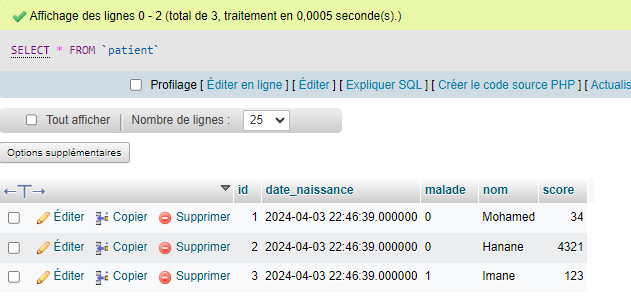

<h3>TP3 partie 1</h3>
<h4>Patient Entity</h4>

<h4>Ajout de Patients</h4>
<h5>1/ Avec l'objet</h5>

<h5>2/ Avec le constructeur</h5>

<h5>3/ Avec le builder</h5>

<h4>Base de donnees H2</h4>

<h4>Base de donnees MySql</h4>

<h4>Controller liste patients</h4>

<h4>Liste patients</h4>

<h5>Code html</h5>

<h4>Pagination</h4>
<h5> Controller</h5>

<h5>Page web </h5>

<h6>3.3/ Affichage </h6>

<h4>Recherche Patient</h4>

<h4>Supprimer Patient</h4>

